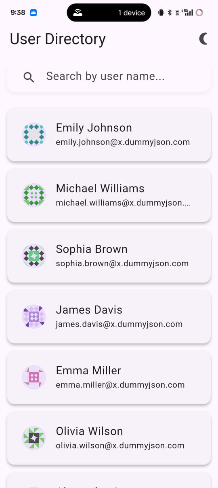
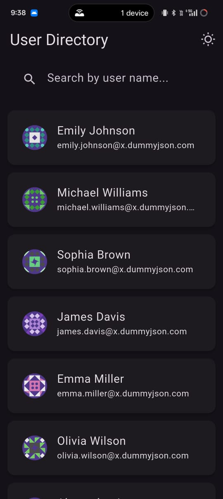
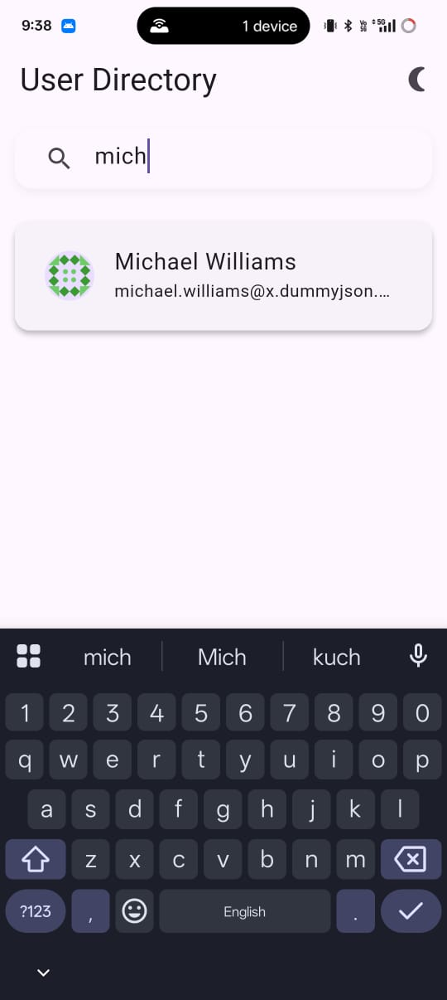
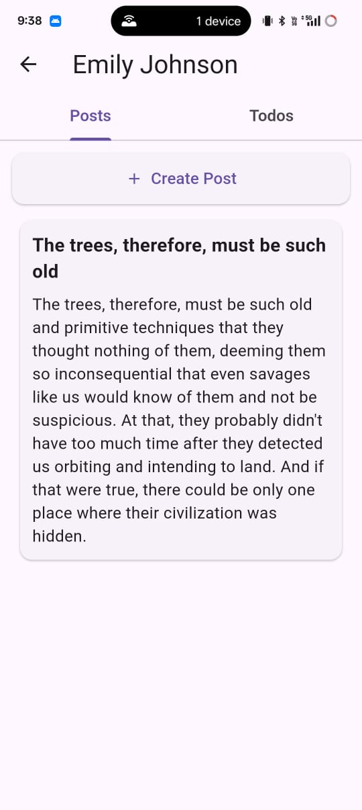
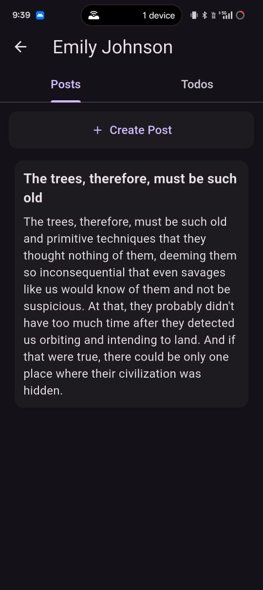
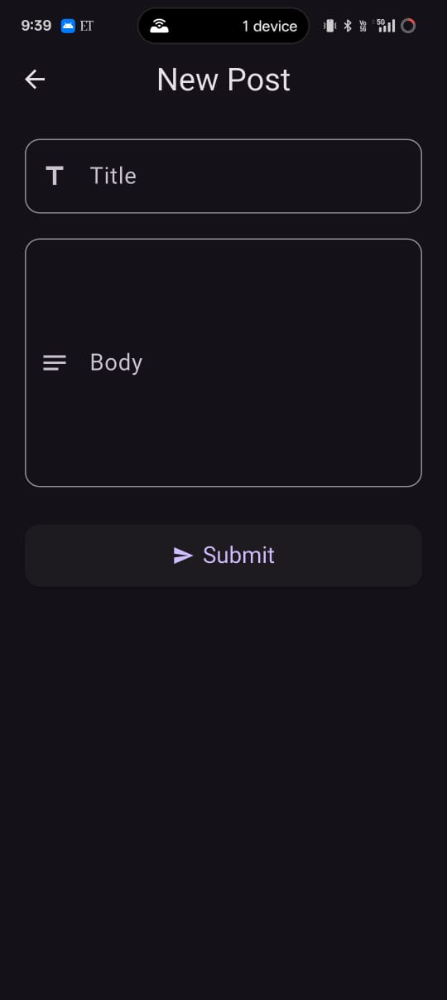
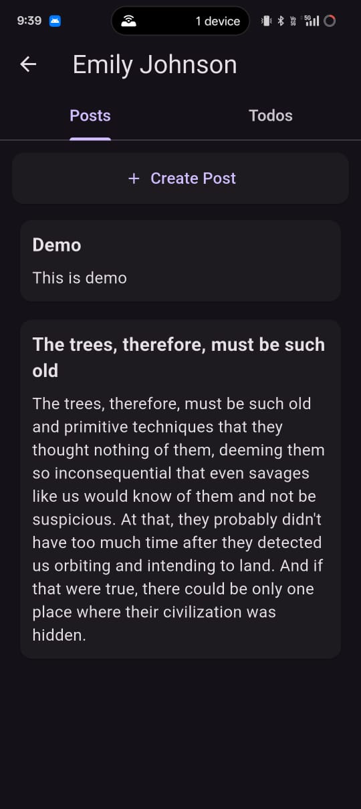
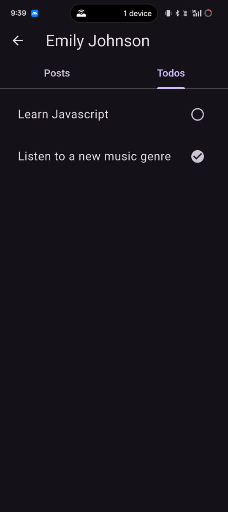

# 🧠 User Management Flutter App

A user management Flutter app using BLoC pattern, REST API integration, pagination, offline caching with Shared Preferences, and dark/light mode toggle.

---

## 🖼️ App Screenshots

| | | |
|---|---|---|
|  |  |  |
|  |  |  |
|  |  | |

---

## 🏗️ Architecture

The app follows the **BLoC (Business Logic Component)** pattern:

### 🔁 BLoC

- Handles application logic and state transitions
- Emits states in response to incoming events

### 🧩 Repository

- Abstracts API calls
- Provides data to BLoC

### 🧱 Models

- `User`, `Post`, and `Todo` model classes

### 🖼️ UI

- Responsive screens that rebuild based on BLoC state

---

## ✨ Features

| Feature                  | Description                                         |
|--------------------------|-----------------------------------------------------|
| 🔍 Search                | Real-time user name search                          |
| ⬇️ Pagination            | Infinite scroll loading of user list               |
| 🔄 Pull-to-refresh       | Refresh user list on swipe down                    |
| ✍️ Add Post              | Create new post for a user (offline simulated)     |
| 💾 Offline Storage       | Posts saved using Shared Preferences               |
| 🌙 Light/Dark Mode       | Switch between sun (light) and moon (dark) themes  |

---

## 🔧 Setup Instructions

### 🖥️ Prerequisites

- Flutter SDK (3.0+)
- Dart SDK
- An emulator or physical device

### 📦 Installation

1. **Clone the repository:**

   ```bash
   git clone https://github.com/yourusername/your-repo-name.git
   cd your-repo-name
   ```

2. **Install dependencies:**

   ```bash
   flutter pub get
   ```

3. **Run the app:**

   ```bash
   flutter run
   ```

---

## 📁 Project Structure

```bash
lib/
│
├── blocs/                # BLoC state management
│   ├── user_list/        # BLoC for listing users
│   └── user_detail/      # BLoC for user detail + posts/todos
│
├── models/               # Model classes (User, Post, Todo)
│
├── repositories/         # API and data fetching logic
│
├── screens/              # UI Screens
│   ├── user_list_screen.dart
│   └── user_detail_screen.dart
│
├── utils/
│   └── shared_prefs_helper.dart  # SharedPreferences utility for offline posts
│
└── main.dart             # App entry point
```

## 👨‍💻 Author

**Rishi Vejani**

Feel free to connect or contribute via issues or pull requests!
